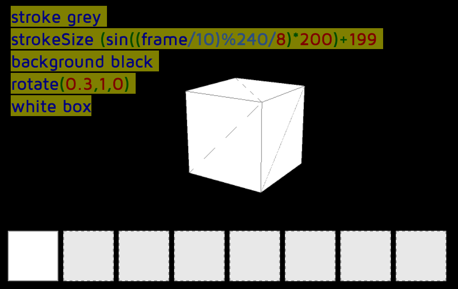

# Tangible TapTapBox. Live coding for 2yo+ kids!

TapTapBox est une collaboration entre [Magic Makers](http://magicmakers.fr) (Romain Liblau, [Claude Terosier](http://twitter.com/)) et [Julien Dorra](http://twitter.com/juliendorra) initiée à l'occasion de la première Fête du Code Créatif au Centre Pompidou. 

### Demo

[http://juliendorra.com/taptapbox](http://juliendorra.com/taptapbox)

 - Utilisez les 4 flèches du clavier pour ajouter les 4 commandes à votre séquence, 
 - Barre d'espace pour lancer la séquence
-  touche G pour remettre la séquence à zéro

Pour plus de fun, **branchez une MakeyMakey** sur votre ordinateur, et construisez **un plateau de commande tangible** comme celui que nous avons imaginé :



### Comment ça marche ?

MakeyMakey + Javascript Sequencer+ LiveCodeLab = Cubes qui dansent codés en direct via des cartes tangibles

TapTapBox utilise MakeyMakey pour la partie tangible, du Javascript spécifique pour la gestion des séquence et [LiveCodeLab](http://livecodelab.net) pour le code 3D temps réel.

Pour le moment nous utilisons une version à peine modifié de LiveCodeLab (mise en globales des objets editor et autocoder; suppression du focus permanent sur codeMirror). L'objectif est d'intégrer la version standard de LiveCodelab une fois que celui-ci exposera ces possibilitée via son API.

---

TapTapBox is a collaborative project from Magic Makers (Romain Liblau, Claude Terosier) and Julien Dorra [@juliendorra](http://twitter.com/juliendorra) launched for the first Fête du Code Créatif (Creative Coding Party/Fest) at Pompidou Center in Paris.

### Demo

[http://juliendorra.com/taptapbox](http://juliendorra.com/taptapbox)

 - Use the 4 arrow keys to add the 4 commands to your sequence,  
- Space bar to play the sequence
- G key to reset the sequence
For more fun, plug a MakeyMakey on your computer, and build a tangible command plate



### How does it work?

MakeyMakey + Javascript Sequencer + LiveCodeLab = Dancing Cubes Live Coded with tangible tiles

TapTapBox use MakeyMakey for the tangible part, dedicated Javascript for managing the sequencer and [LiveCodeLab](http://livecodelab.net) for the realtime 3D live code.

At the moment we use a nearly standard LiveCodeLab version (we only turn the editor and autocoder objects into globals; and supress the automatic re-focus on codeMirror textArea). The goal is to only use the standard LiveCodeLab version once it'll expose these possibilities via its API.
